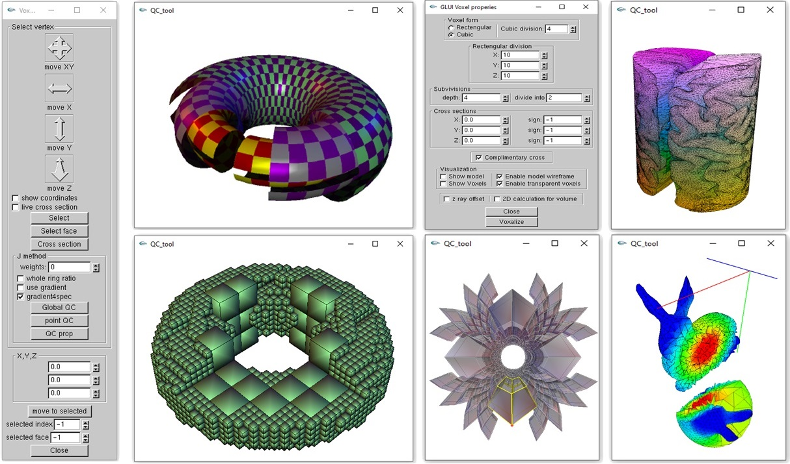
# QC_tool: C++ library for visualization and processing of 2D and 3D meshes
This is a lightweight C++ library for visualization and  processing  of surface meshes  and volumetric models.  This library supports triangle meshes, tetrahedral meshes and voxel shapes. It is based on  [OpenMesh](https://www.graphics.rwth-aachen.de/software/openmesh/) dataset and [glut](https://www.opengl.org/resources/libraries/glut/)  toolkit. 

[`Technical report`](https://researchgate.com/1234567_qc_tool)   [`Video `](https://www.youtube.com/channel/12345qc_tool)  

## Dependencies

* [OpenMesh](https://www.graphics.rwth-aachen.de/software/openmesh/) (mesh data structure)
* [GMM](http://getfem.org/gmm/) (default linear solver)
* [glut](https://www.opengl.org/resources/libraries/glut/) (OpenGL interface)
* [glui](https://github.com/libglui/glui) (GUI interface for glut)
* [ofxOctree](https://github.com/ox/ofxOctree) (collision detection)

## Binary

Windows executable:   ```./binary/qc_tool.exe```  

* It can be run in  GUI  or command line modes

* Additional win32 libraries can  be downloaded from  [qc_tool_libs.zip](https://www.onedrive/qc_tool_libraries_1234)  

  

## Data formats
See ```./data/```  for  examples of different input mesh formats 
### 2D input
It supports .obj  and .off files 

### 3D input

Tetrahedral meshes and voxel shapes can be generated from closed surface meshes (obj , off) 

Tetrahedral meshes with vertex attributes  can also be loaded from  .t files: 

```
# tet mesh in .t format with a single vertex attribute
Vertex 0 -0.5  0.5 -0.5  0.0
Vertex 1 -0.5  0.5  0.5  1.0
Vertex 2  0.5  0.6 -0.4  2.0
Vertex 3  0.5 -0.6  0.4 -1.0
Tet 0 1 0 2 3
```

 * Use  scripts from ```./utils/``` to convert other 3D mesh files to .t format

## Windows 

| windows                | explanation                                                  |
| :--------------------- | :----------------------------------------------------------- |
| 3D output              | OpenGL/ GLUT main window                                     |
| console output / input | info and additional inputs                                   |
| GUI                    | Navigation and visualization of voxels and tetrahedra; lighting and mapping parameters |

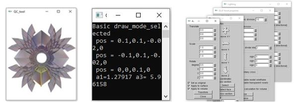

## User manual 

See animated examples in ```./manual/```

### Data load & save

| Key             | explanation                                                  |
| :-------------- | :----------------------------------------------------------- |
| 'o'             | load a mesh file (.obj, .off, .t)                            |
| Left CNTR + 'o' | Add tetrahedral mesh from .t file to previously loaded surface mesh |
| Left CNTR + 's' | Save surface mesh as .off or .obj file, and volume mesh as .t file |

### Camera 

| Key               | explanation              |
| :---------------- | :----------------------- |
| Arrows up, down   | Camera zoom in/out       |
| Arrows   right    | Rotation animation       |
| Mouse Left Button | Rotate around the origin |

### Voxelization 

Open  GUI from  popup menu: ```Mouse Middle Button: Voxel > Voxel Properties```

* This GUI divides volume contained inside  a closed surface into voxels  

| item                               | possible values                         | explanation                                                  |                            image                             |
| :--------------------------------- | --------------------------------------- | :----------------------------------------------------------- | :----------------------------------------------------------: |
| Voxel form and number of divisions | Boolean and integers                    | Rectangular or cubic shapes of voxels. *Cubic division* and *rectangular division* specify how much voxels are generated along the  x, y and z axes of the bounding cube and of the bounding box, respectively.  See `./manual/generate_voxels.gif` |                 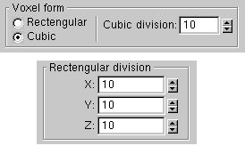                 |
| Subdivisions                       | integers                                | First, bounding box is divided into specified number of cubic or rectangular voxels. Then, voxels contained inside the closed surface are recursively subdivided into a given number of sub-voxels. ```depth``` sets the maximal number of these recursive subdivisions |             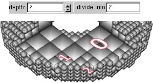              |
| Cross section                      | *X*,*Y*,*Z* = doubles; *sign* ={-1,0,1} | It defines  a cross-section of the volume for voxelization. If all parameters  ```sign``` are set to zero (default), then the entire volume, contained inside the closed surface  will be divided into voxels.  Otherwise, each non-zero  value of   ```sign``` specifies a half space above (*sign=1*) or below (*sign=-1*) the planes *x=X*, *y=Y*  and *z=Z*.  The intersection of these half spaces is divided into voxels. See `./manual/cross_section.gif` | 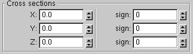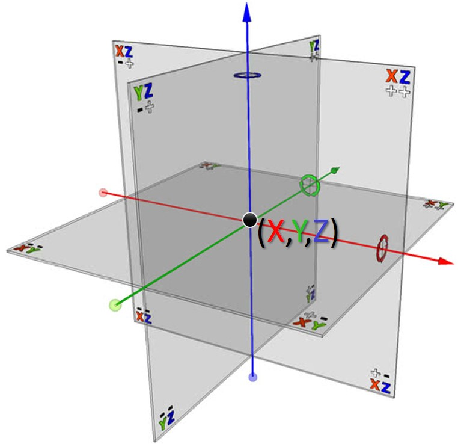 |
| Complementary cross                | Boolean                                 | Switch between the two modes: voxelize a cross-section of the volume, voxelize the complement of the cross-section |         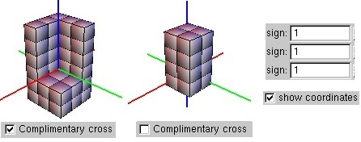          |

### Visualization

* Standard shading modes are selected from the primary  popup menu ```Mouse Right Button```

  * Different geometry processing parameters can be  visualized by selecting these parameters from the primary menu 

    | item                                                         | explanation                                               |
    | :----------------------------------------------------------- | :-------------------------------------------------------- |
    | Wireframe, Hidden lines, Solid smooth, Solid Flat            | Standard shading modes                                    |
    | Mean / Gaussian /Max normal  curvatures, Cylindrical / Spherical coordinates and etc. | Visualization of different geometry processing parameters |
    | vAttribute                                                   | Color coded vertex attributes from .t mesh file           |

    

* Additional modes can be selected from the secondary popup menu ```Mouse Middle Button```

  | item             | explanation                                                  | image                                |
  | :--------------- | :----------------------------------------------------------- | ------------------------------------ |
  | Glue             | Combine several visual modes. E.g.,  set the smooth shading with vertex normals and wireframe by clicking first ```Mouse Right Button: Solid Smooth``` , then selecting  ```Mouse Middle Button: Glue > Glue vertex normal   ``` and  ```Glue > Glue wireframe  ``` | 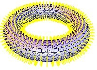      |
  | Color  property  | Material colors for surfaces, volumes and wireframes;  directional and point source lighting (```Color properties > Lighting  ```) | 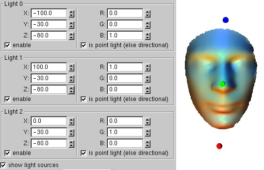           |
  | Set transparency | To enable transparent materials click ```MMB```, select this menu item and then press ```'+'  ```, ```'-'  ```to adjust values of the alpha channel | 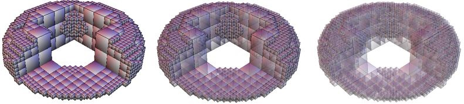 |

* Open Voxel Navigate GUI to show  cross-sections of volumes  and to visualize selected mesh elements:  ```Mouse Middle Button: Voxel > Voxel Navigate```

  | item                                       | explanation                                                  |                   image                   |
  | :----------------------------------------- | :----------------------------------------------------------- | :---------------------------------------: |
  | Set axis for selections and cross sections | Drag and drop X,Y,Z arrow buttons. Set ```show coordinates``` to show the axes |      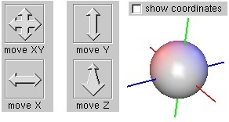      |
  | Cross section                              | In live cross section mode, drag and drop X,Y,Z arrow buttons. Otherwise press the ```Cross section  ``` button. Positive directions of cross planes are set according to ```sign``` elements from the *Voxel Property GUI* | 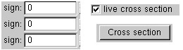 |
  | Selection                                  | For volumetric meshes, press ```Select``` button to highlight the nearest vertex and its neighboring cells. Press  ```Select face``` to highlighted the nearest triangular faces.  Press  ```move to selected``` to move coordinate axis to given indices of a vertex or a face (set ```index=-1``` to disable  selection) |     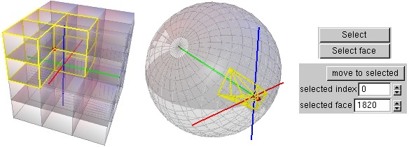      |
  | J method                                   | Compute deformation  Jacobian on the selected face / vertex. |                                           |

* Press ``` 'S'``` to select Edge/Face/Connected Component  mode. Then, press ``` '<'``` and ``` '>'``` for iterating over these elements and ``` '-'``` and ``` '+'``` for adding/ removing neighboring elements to the selections 

* Iteration over mesh elements 

  | item                      | explanation                                                  |                                     |
  | :------------------------ | :----------------------------------------------------------- | :---------------------------------: |
  | Select mode               | Press ``` 'S'``` to select Edge / Face / Connected Component  modes. |   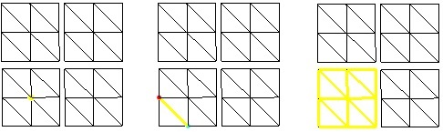    |
  | Iteration and propagation | Press ``` '<'``` and ``` '>'``` for iterating over these elements and ``` '-'``` and ``` '+'``` for adding/ removing neighboring vertices  to the selections | 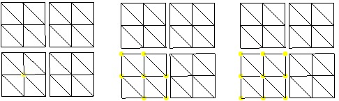 |

### Deformations and Parametrization 

Meshes can be parametrized and  deformed by selecting an appropriate item from the secondary menu ( ```Mouse Middle Button```) 

* Some of these deformations can be computed in the command line mode 

* Deformations are computed with respect to the origin. Press ```'a'``` to draw the axis and see the origin of the model

  * To align model click ```Mouse Right Button: Place at origin     ``` 

* Press ```Tab  ``` to switch between the original and  deformed models

  | deformation                                         | explanation                                                  | image                            |
  | :-------------------------------------------------- | :----------------------------------------------------------- | -------------------------------- |
  | UV mapping of surfaces                              | Compute linear parametrization for each connected component of surface mesh. Press ```'u'``` ,```'h'``` and  ```'m'``` to compute uniform, cotangent weighted and mean-value  harmonic maps to a disc, respectively. Press ```'b'``` for uniform harmonic mapping onto a rectangle (edges of rectangle are boundary vertices with maximal angles). Click ```MRB: Textured mesh ```,  ```MRB: UV domain ``` to show  mesh texture and its target domain. Press ``` '<'``` and ``` '>'``` to rescale texture coordinates. For non-connected meshes use ```MMB: Color property > Component colors ``` to highlight connected components | 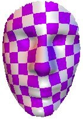        |
  | Mapping of volumes/surfaces onto a ball/sphere      | Click ```MMB:Volume Parametrization > Stretch to ball ``` to map volumetric/ surface mesh to a ball.  To enter additional mapping parameters click ```MMB:Volume Parametrization > Stretch to ball custom ``` and ```MMB:Volume Parametrization > Stretch to ball from point```  and then enter these parameters in  the console window ( for details see the bibliography) | 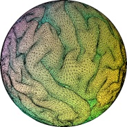     |
  | Mapping of volumes volumes/surfaces onto a cylinder | Click ```MMB:Volume Parametrization > Stretch to cylinder ``` and enter the power of the mapping into the console. Note that  these mappings are computed with respect to the origin ( for details see the bibliography) | 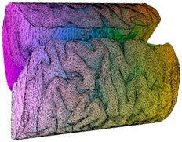 |
  | Quasi-conformal mapping of surfaces and volumes     | Click ```MMB:Volume Parametrization > Map by folding```,```Map by folding```, ```Map radial``` and press ``` '-'``` and ``` '+'``` to control the amount of the distortion. Additional deformations are computed by selecting items from the popup menu ```MMB:Zorich``` and ```MMB:conter power```. | 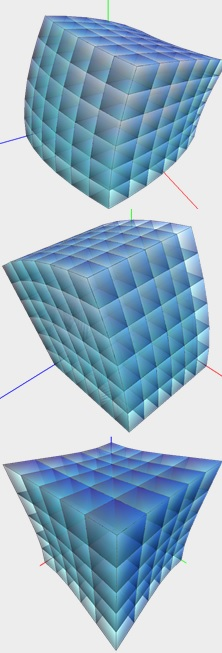        |
  | Affine transformations                              | Open GUI  ```Mouse Middle Button > Affine transformation``` to set translation, scale and rotation components of the mapping. Affine transformations can be applied to the boundary surface and to the interior volume, or to both of them. |          |
  | Noisy deformations                                  | Click ```MMB:Add noise``` and press ``` '-'``` and ``` '+'``` to control the noise amplitude | 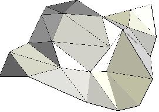     |

## Command line 

It maps the given input mesh (```-o```) to a ball/ sphere and save results  in obj, off or t files (```-s```)

<blockquote><code>
 qc_tool.exe -o input_file.t -s out_file.t -move2center -map2ball 
</code></blockquote>

| optional flags | explanation                                                  |
| :------------- | :----------------------------------------------------------- |
| -move2center   | First, move the center of  the mass to the origin and then compute the mapping |
| -get_dist      | Compute distortions obtained by the mapping                  |

## Source code

The source code, demo scripts and project files will  be available in a near future

## Bibliography 

If you use this toolkit,  please consider citing:

```
@inproceedings{naitsat2015volumetric,
  title={Volumetric quasi-conformal mappings},
  author={Naitsat, Alexander and Saucan, Emil and Zeevi, Yehoshua Y},
  booktitle={Proceedings of the 10th International Conference on Computer Graphics Theory and Applications},
  pages={46--57},
  year={2015}
}

@inproceedings{naitsat2016geometric,
  title={Geometric Approach to Estimation of Volumetric Distortions.},
  author={Naitsat, Alexander and Saucan, Emil and Zeevi, Yehoshua Y},
  booktitle={VISIGRAPP (1: GRAPP)},
  pages={105--112},
  year={2016}
}
```


## License

This project is licensed under Mozilla Public License, version 2.0 - see the [LICENSE](LICENSE) file for details

